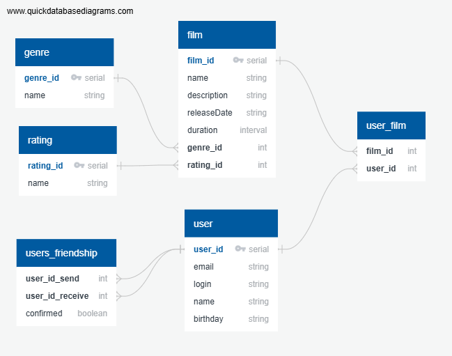

# java-filmorate
Template repository for Filmorate project.

## Предварительная схема БД


## Примеры запросов SQL

### Таблица film
- Вставка данных
```sql
INSERT INTO film (name, description, releaseDate, duration, genre_id, rating_id)
VALUES ('Inception', 'A mind-bending thriller', '2010-07-16', '02:28:00', 1, 2);
```

- Удаление записи
``` sql
DELETE FROM film
WHERE film_id = 3;
```

- Обновление записи
```sql
UPDATE film
SET name = 'Inception (Updated)', description = 'A complex thriller'
WHERE film_id = 1;
```

- Обычный SELECT
```sql
SELECT * FROM film
WHERE EXTRACT(YEAR FROM CAST(releaseDate as DATE)) > 2000;
```

- SELECT с агрегацией
```sql
SELECT genre_id, COUNT(*) AS film_count
FROM film
GROUP BY genre_id;
```

### Таблица rating

- Вставка данных
```sql
INSERT INTO rating (name)
VALUES ('PG-13'), ('R'), ('G');
```

- Удаление записи
```sql
DELETE FROM rating
WHERE rating_id = 3;
```

- Обновление записи
```sql
UPDATE rating
SET name = 'NC-17'
WHERE rating_id = 2;
```

- Обычный SELECT
```sql
SELECT * FROM rating;
```

### Таблица genre
- Вставка данных
```sql
INSERT INTO genre (name)
VALUES ('Action'), ('Comedy'), ('Drama');
```

- Удаление записи
```sql
DELETE FROM genre
WHERE genre_id = 2;
```

- Обновление записи
```sql
UPDATE genre
SET name = 'Science Fiction'
WHERE genre_id = 1;
```

- Обычный SELECT
```sql
SELECT * FROM genre;
```

### Таблица user
- Вставка данных
```sql
INSERT INTO user (email, login, name, birthday)
VALUES ('john@example.com', 'john', 'John', '1999-09-09');
```

- Удаление записи
```sql
DELETE FROM user
WHERE user_id = 4;
```

- Обновление записи
```sql
UPDATE user
SET name = 'Jack', birthday = '1997-07-07'
WHERE user_id = 2;
```

- Обычный SELECT
```sql
SELECT * FROM user
WHERE EXTRACT(YEAR FROM CAST(birthday as DATE)) < 2000;
```

- SELECT с агрегацией (количество пользователей по году рождения)
```sql
SELECT EXTRACT(YEAR FROM CAST(birthday as DATE)) AS birth_year, COUNT(*) AS user_count
FROM user
GROUP BY birth_year;
```

### Таблица user_film
- Вставка данных
```sql
INSERT INTO user_film (film_id, user_id)
VALUES (1, 3), (2, 3), (4, 2);
```

- Удаление записи
```sql
DELETE FROM user_film
WHERE film_id = 1 AND user_id = 3;
```

- Обычный SELECT (фильмы, добавленные пользователем с id 3)
```sql
SELECT film.name
FROM user_film
JOIN film ON user_film.film_id = film.film_id
WHERE user_film.user_id = 3;
```

### Таблица users_friendship

- Вставка данных
```sql
INSERT INTO users_friendship (user_id_send, user_id_receive, confirmed)
VALUES (1, 2, false), (3, 4, true);
```

- Удаление записи
```sql
DELETE FROM users_friendship
WHERE user_id_send = 1 AND user_id_receive = 2;
```

- Обновление записи (подтверждение дружбы)
```sql
UPDATE users_friendship
SET confirmed = true
WHERE user_id_send = 1 AND user_id_receive = 2;
```

- Обычный SELECT (друзья пользователя с id 1)
```sql
SELECT user_id_receive AS friend_id
FROM users_friendship
WHERE user_id_send = 1 AND confirmed = true
UNION
SELECT user_id_send AS friend_id
FROM users_friendship
WHERE user_id_receive = 1 AND confirmed = true;
```